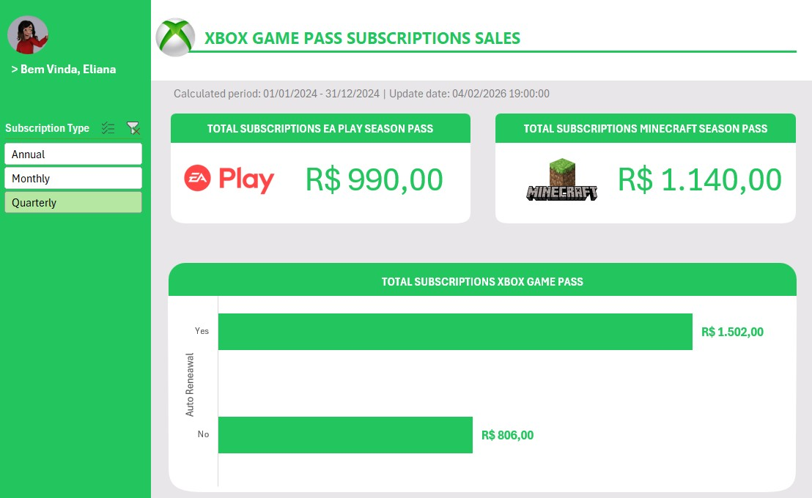

# Dashboard de Vendas de inscrições de assinaturas do XBOX / Curso DIO

## 📋 Descrição
O objetivo deste projeto foi criar um dashboard de vendas, com foco na organização e visualização de dados. O objetivo foi transformar dados brutos em informações visuais claras e úteis, permitindo uma análise eficaz do desempenho de vendas e a tomada de decisões baseadas em dados.

## 🚀 Funcionalidades
* **Menu interativo:** Menu interativo para verificação de faturamento de vendas conforme o período selecionado.

## 🛠️ Tecnologias Utilizadas
* Microsoft Excel 

## 📸 Capturas de Tela
Abaixo está o print do Dashboard:

## Autor
[Andreia Pontes]
[www.linkedin.com/in/andreia-cristina-pontes-8a55aa]
